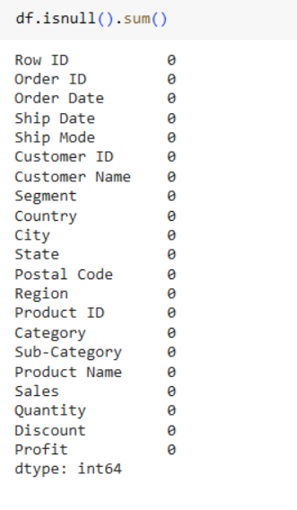
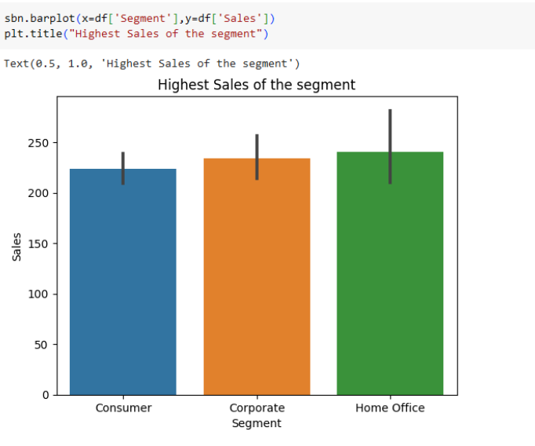
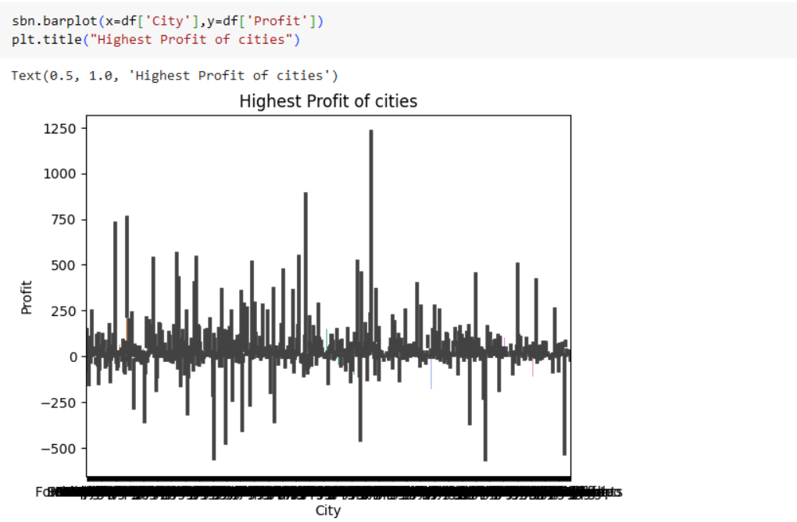
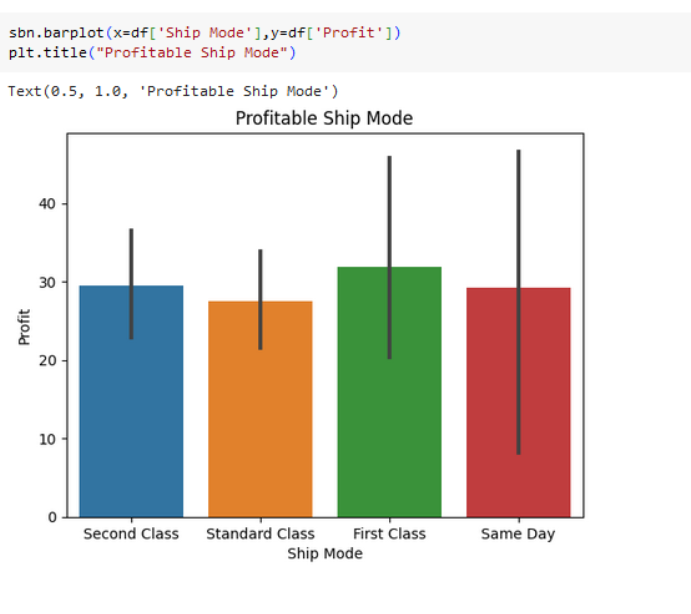
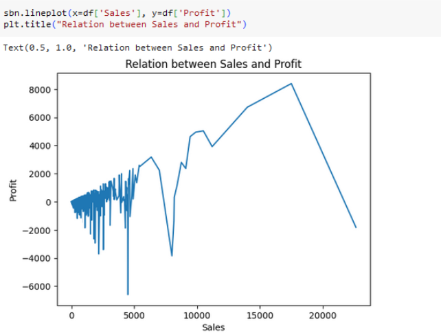
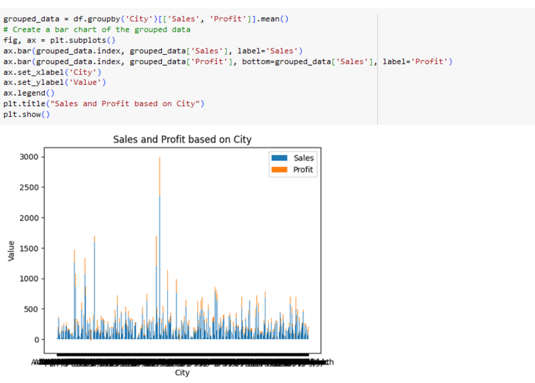
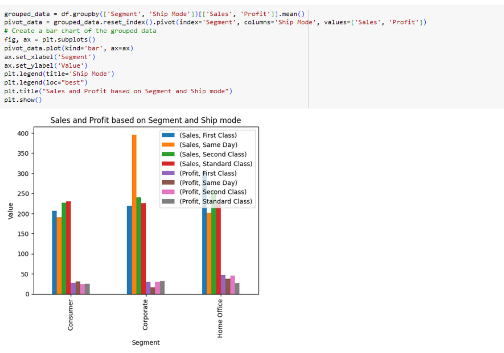
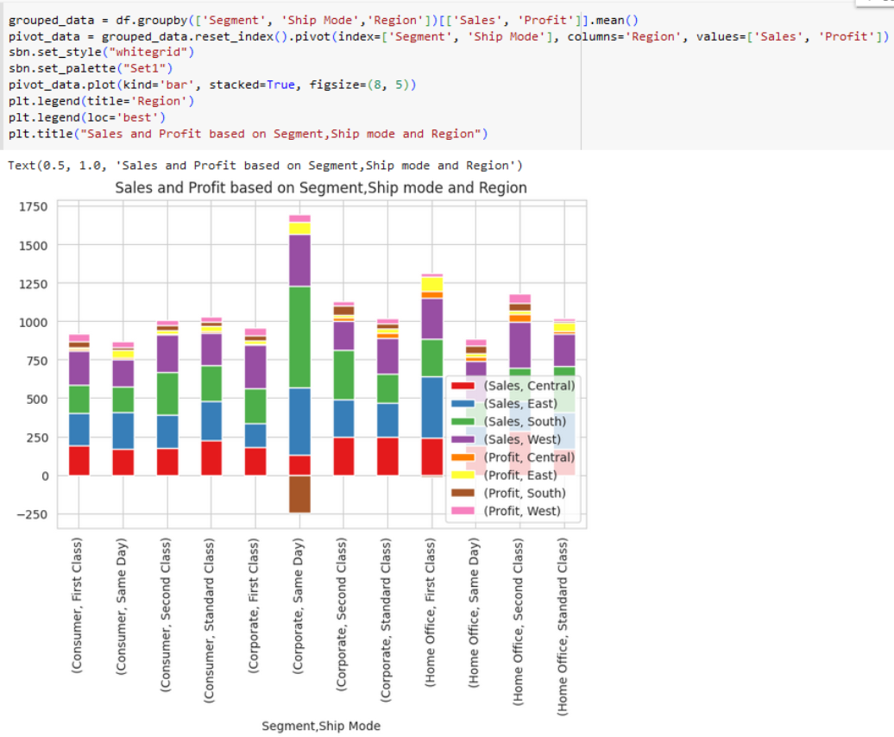

# Ex-07-Data-Visualization-

# AIM
To Perform Data Visualization on the given dataset and save the data to a file. 

# EXPLANATION
Data visualization is the graphical representation of information and data. By using visual elements like charts, graphs, and maps, data visualization tools provide an accessible way to see and understand trends, outliers, and patterns in data.

# ALGORITHM
### STEP 1
Read the given Data
### STEP 2
Clean the Data Set using Data Cleaning Process
### STEP 3
Apply Feature generation and selection techniques to all the features of the data set
### STEP 4
Apply data visualization techniques to identify the patterns of the data.


# CODE
Developed by : Arshatha

Register number : 212222230012

```py
import pandas as pd
import numpy as np
import matplotlib.pyplot as plt
import seaborn as sbn
df=pd.read_csv("/content/Superstore(1).csv",encoding='windows-1252')
df.head()

df.info()
df.isnull().sum()
1.Which Segment has Highest sales?
sbn.barplot(x=df['Segment'],y=df['Sales'])
plt.title("Highest Sales of the segment")

2.Which City has Highest profit?
sbn.barplot(x=df['City'],y=df['Profit'])
plt.title("Highest Profit of cities")

City=df.loc[:,["City","Profit"]]
df.head(5)
City=City.groupby(by=["City"]).sum().sort_values(by="Profit")
plt.figure(figsize=(10,10))
sbn.barplot(x=City.index,y="Profit",data=City)
plt.xticks(rotation = 90)
plt.xlabel=("City")
plt.ylabel=("Profit")
plt.show()

3.Which ship mode is profitable?
sbn.barplot(x=df['Ship Mode'],y=df['Profit'])
plt.title("Profitable Ship Mode")

4.Sales of the product based on region.
sbn.barplot(x=df['Sales'], y=df['Region'])
plt.title("Sales of Product based on Region")

5.Find the relation between sales and profit.
sbn.lineplot(x=df['Sales'], y=df['Profit'])
plt.title("Relation between Sales and Profit")

6.Find the relation between sales and profit based on the following category. i) Segment ii)City iii)States iv)Segment and Ship Mode
v)Segment, Ship mode and Region 
i) Segment
grouped_data = df.groupby('Segment')[['Sales', 'Profit']].mean()
# Create a bar chart of the grouped data
fig, ax = plt.subplots()
ax.bar(grouped_data.index, grouped_data['Sales'], label='Sales')
ax.bar(grouped_data.index, grouped_data['Profit'], bottom=grouped_data['Sales'], label='Profit')
ax.set_xlabel('Segment')
ax.set_ylabel('Value')
ax.legend()
plt.title("Sales and Profit based on Segment")
plt.show()

2.City
grouped_data = df.groupby('City')[['Sales', 'Profit']].mean()
# Create a bar chart of the grouped data
fig, ax = plt.subplots()
ax.bar(grouped_data.index, grouped_data['Sales'], label='Sales')
ax.bar(grouped_data.index, grouped_data['Profit'], bottom=grouped_data['Sales'], label='Profit')
ax.set_xlabel('City')
ax.set_ylabel('Value')
ax.legend()
plt.title("Sales and Profit based on City")
plt.show()

3.states
grouped_data = df.groupby('State')[['Sales', 'Profit']].mean()
# Create a bar chart of the grouped data
fig, ax = plt.subplots()
ax.bar(grouped_data.index, grouped_data['Sales'], label='Sales')
ax.bar(grouped_data.index, grouped_data['Profit'], bottom=grouped_data['Sales'], label='Profit')
ax.set_xlabel('State')
ax.set_ylabel('Value')
ax.legend()
plt.title("Sales and Profit based on States")

4.Segment and Ship Mode
grouped_data = df.groupby(['Segment', 'Ship Mode'])[['Sales', 'Profit']].mean()
pivot_data = grouped_data.reset_index().pivot(index='Segment', columns='Ship Mode', values=['Sales', 'Profit'])
# Create a bar chart of the grouped data
fig, ax = plt.subplots()
pivot_data.plot(kind='bar', ax=ax)
ax.set_xlabel('Segment')
ax.set_ylabel('Value')
plt.legend(title='Ship Mode')
plt.legend(loc="best")
plt.title("Sales and Profit based on Segment and Ship mode")
plt.show()

5.Segment, Ship mode and Region
grouped_data = df.groupby(['Segment', 'Ship Mode','Region'])[['Sales', 'Profit']].mean()
pivot_data = grouped_data.reset_index().pivot(index=['Segment', 'Ship Mode'], columns='Region', values=['Sales', 'Profit'])
sbn.set_style("whitegrid")
sbn.set_palette("Set1")
pivot_data.plot(kind='bar', stacked=True, figsize=(8, 5))
plt.legend(title='Region')
plt.legend(loc='best')
plt.title("Sales and Profit based on Segment,Ship mode and Region")
```
# OUTPUT



















# RESULT 
Hence the data visualization method for the given dataset applied successfully.

